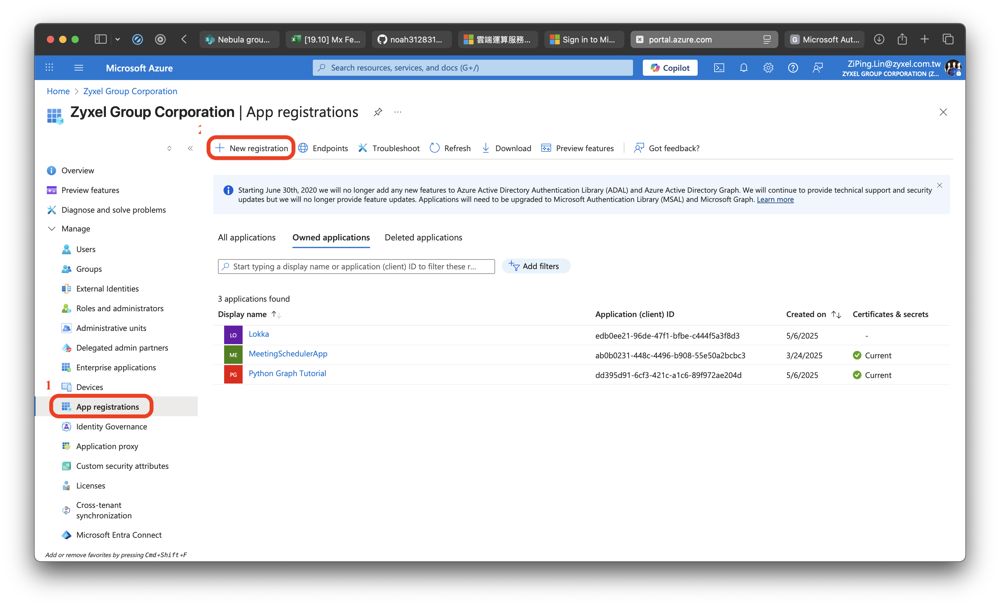
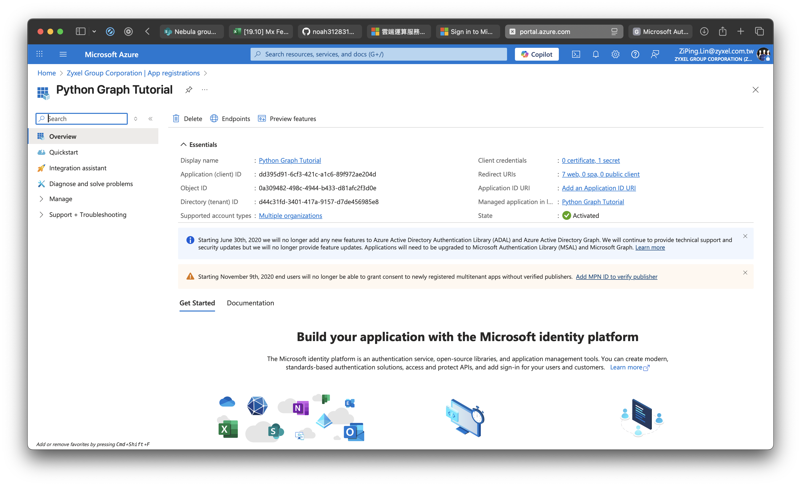
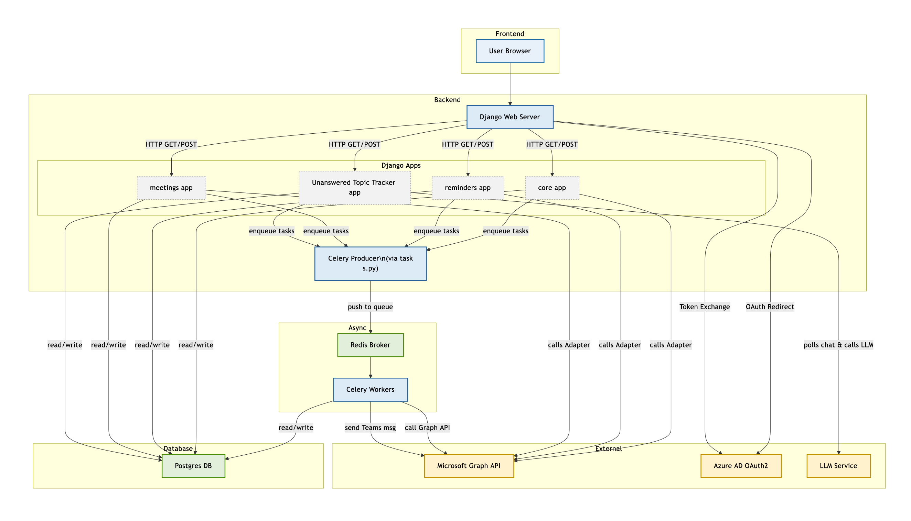

# Microsoft Automation Platform

A Django-based automation tool for Microsoft Teams and SharePoint, offering seamless integration with the Microsoft Graph API. Key features include automated meeting scheduling, SharePoint-driven reminders, and intelligent Teams chat analysis.

---

## Features

- **Automated Meeting Scheduling**  
  Effortlessly schedule and monitor meetings with real-time progress tracking.

- **SharePoint Reminders**  
  Tracks project updates by monitoring SharePoint files, sends automated reminders to stakeholders via Teams, and updates SharePoint based on responses.


  **The reminder system relies on a predefined column structure in the task sheet, as shown below:**
  ```
  # Column index mapping for the SharePoint task template
    "status": 3,               # Current task status
    "task": 4,                 # Task description
    "owner": 5,                # Responsible person
    "estimate_start_date": 6,  # Planned start date
    "estimate_days": 7,        # Estimated duration (in days)
    "spent_days": 8,           # Actual time spent
    "due_date": 9,             # Task deadline
    "note": 10,                # Additional comments
    "MR_link": 11,             # Merge request link or PR
    "teams_group_name": 12     # Corresponding Microsoft Teams group
    ```
  Each row in the sheet is parsed using this mapping to generate and send appropriate reminders.
  **Add or modify your own machanism by edit the code in `automation/reminders/sharepoint_client.py`**

- **Unanswered Topic Analysis**  
  Leverages large language models (e.g., Gemini) to analyze Teams chat logs and identify unanswered questions.

---

## Folder Structure

```
automation/
├── core/                    # Handles authentication, Microsoft Graph API, and core logic
├── meetings/                # Meeting scheduling and management functionality
├── reminders/               # SharePoint reminder and notification system
├── unanswered_topic_tracker/ # Utilities for analyzing Teams chat logs
├── static/                  # Static assets (CSS, JavaScript, etc.)
├── templates/               # Django HTML templates
├── requirements.txt         # Python dependencies
├── docker-compose.yml       # Docker orchestration configuration
├── dockerfile               # Docker build configuration
└── manage.py                # Django management script
```

---

## Quick Start

### 1. Clone the Repository
1. Install Docker.
2. Clone the repository:
   ```sh
   git clone https://github.com/noah312831013/Zyxel_Graph_Automation.git
   cd Zyxel_Graph_Automation
   ```
   or download the project as .zip and unzip the file.

### 2. Configuration
1. Register your application in Azure.


2. Create `automation/oauth_settings.yml` by copying and editing `automation/oauth_settings_template.yml`.

### 3. Docker Setup
Build and run all services (Django, Celery, Redis, Postgres):
```sh
cd automation
docker compose up
```

### 4. Local Development
Access the application at:
```
http://localhost:8000
```

For remote access or deployment, update `settings.py`:
```python
ALLOWED_HOSTS = ['your.domain.com']
```

For HTTPS or specific CSRF origins, configure:
```python
CSRF_TRUSTED_ORIGINS = ['https://your.domain.com']
```

**Replace `your.domain.com` with your domain or IP address. Ensure the redirect URL is updated in both Azure and `oauth_settings.yml`.**

## Optional
Install ngrok

---

## Flow Chart


---

## License
Licensed under the MIT License. See [LICENSE](LICENSE) for details.

---

## Credits
Built using Microsoft Graph API and Django.  
Portions of code and templates © Noah312831013.